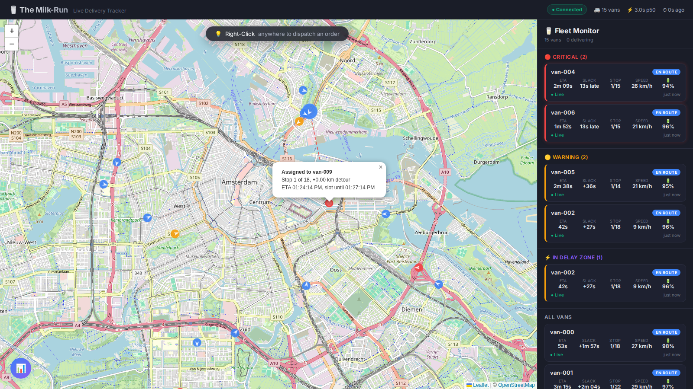
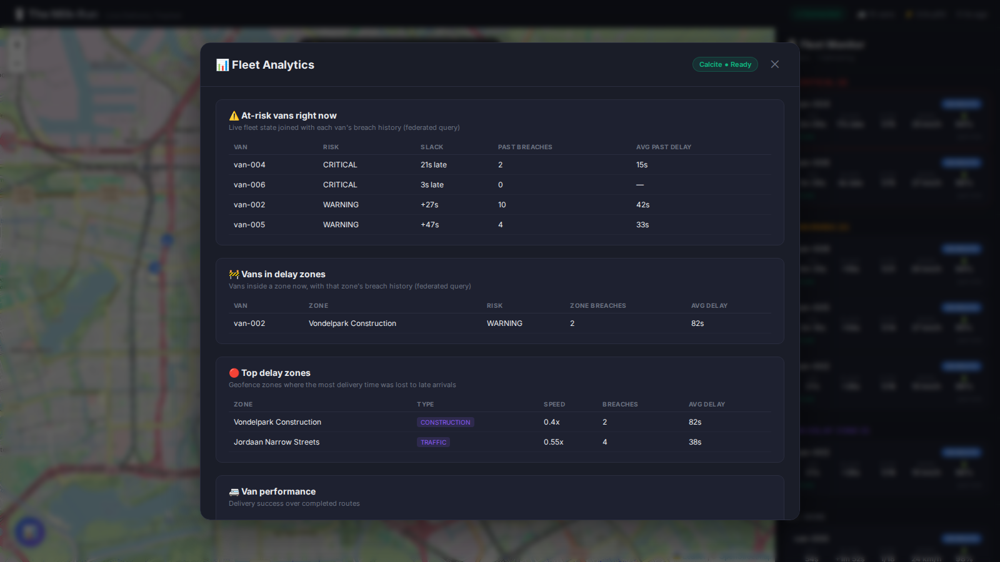

# 🥛 The Milk-Run — Live Delivery Tracker

[](https://github.com/marwan-eid/MilkRun/actions/workflows/ci.yml)
A real-time, event-driven fleet tracking system demonstrating distributed systems proficiency. Simulates Picnic Technologies' milkman-style delivery routing with 50 electric vans in Amsterdam.

## Architecture

```
┌──────────────┐       ┌─────────────────────────────────────────────────────────┐
│  Simulator   │       │               Backend (Spring WebFlux)                 │
│  (TypeScript)│──Kafka──▶ Deserialize → Bloom Dedup → Reorder Buffer           │
│  50 vans     │       │                    ↓                                   │
│  + Chaos     │       │   ETA Engine (Haversine + Geofence + Circuit Breaker)  │
└──────────────┘       │                    ↓                                   │
                       │   Backpressure Sample → SSE Sink ──▶ React Dashboard   │
                       │                    ↓                                   │
                       │   R2DBC Archive │ DLQ │ Apache Calcite Analytics       │
                       └────────┬────────────────────────────┬──────────────────┘
                                │                            │
                       ┌────────▼────────┐          ┌────────▼────────┐
                       │   PostgreSQL    │          │   Prometheus    │
                       │   PostgreSQL    │          │   Prometheus    │
                       │   + PostGIS     │          │   + Grafana     │
                       └─────────────────┘          └─────────────────┘
```

## 📸 Dashboard Previews

### 1. Live Fleet Monitor (Map & SLA Engine)
Autonomous simulation agents traversing their generated waypoints in real-time. The React frontend natively connects to a live Kafka-driven Server Sent Events (SSE) pipe to visualize SLA risks.



### 2. Fleet Analytics Pipeline
A fully reactive SQL federation layer powered by **Apache Calcite**. The backend correlates high-speed stream metrics natively with static PostGIS Datawarehousing zones to aggregate real-time Delay and Efficiency analytics.



## Tech Stack

| Layer | Technologies |
|---|---|
| **Messaging** | Apache Kafka (KRaft mode) |
| **Backend** | Java 21, Spring WebFlux, Project Reactor, reactor-kafka |
| **Database** | PostgreSQL 16 + PostGIS |
| **Analytics** | Apache Calcite (federated SQL) |
| **Resilience** | Resilience4j (circuit breaker) |
| **Metrics** | Micrometer → Prometheus → Grafana, Datadog-ready |
| **Frontend** | React 19 + TypeScript, Leaflet, Server-Sent Events |
| **Native** | GraalVM native image (optional build target) |
| **Simulator** | TypeScript, KafkaJS, chaos engineering modules |

## Prerequisites

- **Docker Desktop** with internet access to Docker Hub
- **JDK 17+** (JDK 21 recommended; JDK 17 supported via `-P local-dev` profile)
- **Maven 3.9+**
- **Node.js 18+**

## Quick Start

```bash
# 1. Start infrastructure (Kafka, PostgreSQL, Prometheus, Grafana)
docker-compose up -d

# 2. Start the backend
cd backend
mvn spring-boot:run                      # JDK 21
mvn spring-boot:run -P local-dev         # JDK 17 fallback

# 3. Start the simulator
cd simulator
npm install && npm start

# 4. Start the frontend dashboard
cd frontend
npm install && npm run dev
# → http://localhost:5173
```

### Troubleshooting

**Docker pull fails with `Client.Timeout` / `certificate_unknown`:**
This is a network connectivity issue (corporate proxy/VPN). Try:
- Disconnecting/connecting your VPN
- Configuring Docker Desktop proxy settings (Settings → Resources → Proxies)
- Using a Docker registry mirror if your org provides one

**Maven SSL errors (`PKIX path building failed`):**
```bash
# Set the Windows certificate store as Maven's trust source
set MAVEN_OPTS=-Djavax.net.ssl.trustStoreType=WINDOWS-ROOT
mvn spring-boot:run -P local-dev
```

## Senior-Level Engineering Features

### Out-of-Order Event Reconciliation
Per-van reorder buffer with configurable grace window and PriorityQueue. Late events routed to DLQ for audit.

### Bloom Filter Deduplication
FNV-1a double-hashing Bloom filter catches duplicate GPS events from cellular retry storms.

### ETA Engine with Circuit Breaker
Haversine distance + geofence speed factors + SLA risk prediction. Resilience4j circuit breaker with linear extrapolation fallback.

### Reactive Backpressure
`Flux.groupBy(vanId).flatMap(g -> g.sample(500ms))` — max 2 SSE updates/sec/van.

### Apache Calcite Query Federation
Federated SQL layer over PostgreSQL for analytical queries without impacting the reactive connection pool.

### GraalVM Native Image
Pre-configured reflection/serialization metadata. Multi-stage Dockerfile with JVM and native build targets.

### Full Observability Stack
Micrometer counters at every pipeline stage. Prometheus scraping + Grafana dashboards. Datadog-compatible dashboard JSON.

## Endpoints

| Endpoint | Description |
|---|---|
| `GET /api/stream/vans` | SSE stream of van state updates |
| `GET /api/vans` | Current snapshot of all vans |
| `GET /api/vans/{id}` | Single van state |
| `GET /api/health/pipeline` | Pipeline metrics |
| `GET /api/analytics/delay-zones` | Calcite: top delay zones |
| `GET /api/analytics/van-performance` | Calcite: van rankings |
| `GET /api/analytics/sla-summary` | Calcite: SLA breach stats |
| `GET /api/observability/health` | System health snapshot |
| `GET /api/observability/ready` | Kubernetes readiness probe |
| `GET /actuator/prometheus` | Prometheus metrics scrape |

## Project Structure

```
MilkRun/
├── docker-compose.yml          # Kafka, PostgreSQL, Prometheus, Grafana
├── simulator/                  # TypeScript fleet simulator (50 vans + chaos)
├── backend/                    # Java/Spring WebFlux reactive engine
│   ├── Dockerfile              # Multi-stage: JVM + GraalVM native
│   └── src/main/java/com/milkrun/
│       ├── api/                # SSE, REST, Analytics, Observability controllers
│       ├── calcite/            # Apache Calcite schema + analytics service
│       ├── config/             # Kafka, Jackson, Resilience4j config
│       ├── consumer/           # Reactive Kafka pipeline + DLQ consumer
│       ├── engine/             # ETA engine + Geofence detector
│       ├── model/              # Domain records (GpsEvent, VanState, etc.)
│       ├── persistence/        # R2DBC repositories
│       └── pipeline/           # Bloom filter dedup + Reorder buffer
├── frontend/                   # React + TypeScript dashboard
│   └── src/
│       ├── components/         # LiveMap, VanMarker, SlaPanel, AnalyticsPanel
│       ├── hooks/              # useVanStream (SSE hook)
│       └── types/              # VanState TypeScript types
└── infra/
    ├── postgres/init.sql       # PostGIS schema + geofence seeds
    ├── prometheus/             # Scrape config
    ├── grafana/                # Datasource provisioning
    └── datadog/dashboard.json  # 13-widget operations dashboard
```

## Tests

```bash
# Simulator (23 tests)
cd simulator && npm test

# Backend (15 tests)
cd backend && mvn test -P local-dev
```
