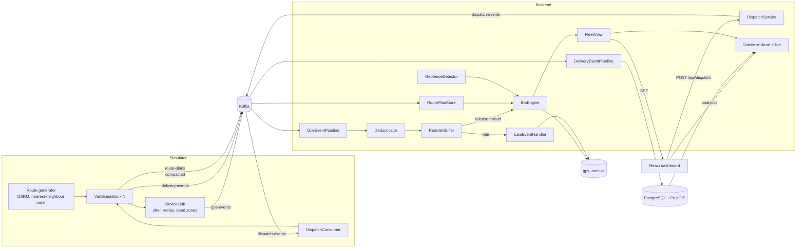

# MilkRun architecture

How the system works, component by component. File paths are relative to the
repository root.

## 1. Overview

- **Simulator** (`simulator/`, TypeScript): drives N vans (default 50) along
  street routes from OSRM, at `TIME_SCALE` (default 4) times real speed. Each
  van publishes a GPS ping every 500 ms, delivery events at each stop, and its
  route plan whenever the route starts or changes. A simulated cellular link
  adds jitter, retries and dead zones.
- **Backend** (`backend/`, Java 21, Spring WebFlux): deduplicates and reorders
  GPS events, predicts each van's arrival at its next stop and whether it will
  make the delivery slot, streams the fleet to browsers over SSE, persists
  deliveries, breaches and GPS tracks, dispatches ad-hoc orders, and serves
  analytics through Apache Calcite.
- **Dashboard** (`frontend/`, React + Leaflet): live map, fleet panel,
  dispatch by right-click, analytics.
- **Infrastructure**: Kafka, PostgreSQL + PostGIS (schema by Flyway),
  Prometheus + Grafana, Caddy for TLS in production.

## 2. Data flow



### Kafka topics

| Topic | Key | Partitions | Producer → consumer | Notes |
|---|---|---|---|---|
| `gps-events` | van id | 10 | simulator → backend group `milkrun-engine` | Offsets committed after processing (deferred commits) |
| `delivery-events` | van id | 10 | simulator → backend group `milkrun-engine-delivery` | Processed in order per partition |
| `route-plans` | van id | 10, **compacted** | simulator → every backend instance (own group, from the beginning) | Latest plan per van |
| `dispatch-events` | van id | 1 | backend → simulator | Assignments chosen by the backend |
| `gps-events-dlq` | original key | 3 | backend | Malformed GPS records, unchanged, with `x-dlq-*` headers |
| `van-state` | van id | 10, 10 min retention | backend ↔ backend | Only with `milkrun.fanout.mode=kafka` |

All van-keyed topics have the same partition count, so one van's GPS,
delivery and plan records land on the same partition number. The backend
declares the topics (`KafkaTopicsConfig`); the simulator creates them too if
it starts first.

## 3. Simulator

**Routes** (`route-generator.ts`). A van picks 2–4 neighbourhoods, visits
them nearest-first and orders their stops nearest-first. One OSRM request
returns the street polyline; leg distances and snapped waypoints map each stop
to a polyline vertex. Planned arrivals come from driving distance at the base
speed plus 40 s per stop; delivery slots end 3–10 simulated minutes after the
planned arrival, except for 15% of stops, which get −1 to +1.5 minutes. When
OSRM is unreachable or rate-limits, straight lines are used.

**Motion** (`van-simulator.ts`). The van's position is a distance along the
polyline. Each tick it advances speed × elapsed time × time scale, at 25 km/h
± 20% and slower inside the delay zones (`geo.ts` mirrors the PostGIS
polygons). It stops exactly on each stop's vertex, dwells 20–60 simulated
seconds (95% delivered), then continues; after the last stop it drives back
to the hub and sends a final `RETURNED` ping.

**Route plans**. Published at start and after every change: stops with
deadlines, planned arrivals and vertex indices, the polyline, the time scale
and base speed.

**Inserting stops** (`insertStop`). A stop inserted before stop *k* replaces
the polyline between the previous stop (or a point ≥150 m ahead of the van)
and stop *k* with an OSRM detour. If the van drives past the detour start
while the router answers, the insertion is retried, so the van never jumps
backwards.

**Cellular link** (`chaos/device-link.ts`). Pings are delivered after
20–300 ms (5% take up to 2 s), about 5% are sent two or three times, and dead
zones (0.5% chance per ping, 2–10 s) buffer pings on the van, losing 10%, and
upload the backlog 1–6 s after reconnecting.

## 4. Backend

### 4.1 GPS pipeline (`consumer/GpsEventPipeline.java`)

```
Kafka consumer thread:  parse + validate → dedup → reorder buffer
release thread (100 ms): events past the 3 s grace window, in order
                         → EtaEngine → SSE sink → GPS archive → ack offset
```

- **Deduplication** (`pipeline/SlidingWindowDedup`): per van, the highest
  sequence number plus a 4,096-bit window below it. Exact; older-than-window
  numbers are rejected as too old; a jump of a million backwards is treated
  as a counter reset. `BloomFilterDedup` (two generations) is the
  alternative (`milkrun.pipeline.dedup-strategy=bloom`).
- **Reordering** (`pipeline/ReorderBuffer`): per-van priority queue by device
  timestamp. An event older than one already released for its van is late
  and goes to `LateEventHandler`, which writes it into `gps_archive` and logs
  it in `dead_letter_log` as reconciled. A terminal `RETURNED` ping or more
  than 50 buffered events release the van at once.
- **Offsets**: every record is acknowledged when it is done (published,
  duplicate, forwarded to the DLQ topic, or reconciled). The receiver uses
  deferred commits (`maxDeferredCommits`), so a partition's committed offset
  never passes an unfinished record.
- **Latency**: `milkrun.pipeline.latency` (device timestamp to published
  state) is about the grace window, ~3 s; `milkrun.pipeline.ingest_lag`
  (device to backend) is ~0.2 s at the median.

### 4.2 ETA and SLA (`engine/`)

- `RoutePlanStore` reads the compacted `route-plans` topic from the beginning
  at startup (throwaway consumer group, no commits), keeps the newest plan per
  van, prepares its geometry (`RouteGeometry`: cumulative distances and a
  zone speed factor per segment) and upserts the planned route in
  `completed_routes`.
- `GeofenceDetector` loads the zone polygons from PostGIS (`ST_AsGeoJSON`)
  every minute and answers point-in-polygon queries by ray casting.
- `EtaEngine`, per GPS event:
  1. map-match the position onto the current leg (previous stop to next stop);
  2. update the van's free-flow speed: progress along the route over time,
     divided by the zone factor, exponentially smoothed; before the first
     measurement, the reported speed × time scale;
  3. ETA = remaining road to the stop, segment by segment, at free-flow speed
     × zone factor;
  4. slack = deadline − predicted arrival → `NONE` (≥ 60 s), `WARNING`
     (0–60 s) or `CRITICAL` (< 0); while delivering, the actual arrival is
     compared instead; `UNKNOWN` without a plan.
  More than 200 m off the leg, or when the Resilience4j breaker is open, the
  straight-line distance × 1.3 is used (`eta_method: STRAIGHT_LINE`). The
  prediction made when a van sets off for a stop is compared with the actual
  arrival (`milkrun.eta.error.seconds`).

### 4.3 Delivery pipeline (`consumer/DeliveryEventPipeline.java`)

Records are grouped by partition and processed one after another within a
partition. Offsets are acknowledged after the writes succeed; failures are
retried three times with backoff and then dead-lettered.

| Event | Writes (all idempotent) |
|---|---|
| `ARRIVAL` | route row if missing; `delivery_logs` row (location, breach flag); `sla_breaches` row when the van arrived after the deadline, with the zone of the stop and the prediction made at departure |
| `DELIVERY_COMPLETED` / `FAILED` | `delivery_logs` row; route counters recomputed from the delivery log |
| `DEPARTURE` | departure time; after the last stop, the route is completed: duration, distance of the archived GPS track, average speed in simulated km/h |

### 4.4 Dispatch (`dispatch/DispatchService.java`)

For every van that is en route or delivering and has a plan, the order is
tried before each remaining stop and after the last one. Cost = extra
distance (straight line × 1.3) + 5 km per stop pushed past its deadline + 5 km
if the order itself misses its slot (20 simulated minutes). Projected
arrivals start from the van's current ETA and keep its current delay. The
cheapest option is returned to the caller and published to `dispatch-events`
keyed by the van; the simulator applies it with `insertStop`.

### 4.5 Fleet view (`fleet/`)

SSE, `/api/vans`, dispatch, health and the Calcite live table read a
`FleetView`:
- `local` (default): the instance's own `EtaEngine` state;
- `kafka`: each instance publishes its vans' states to `van-state` (≤ 2/s
  per van plus status changes) and replicates the whole topic, so several
  instances can serve the whole fleet. `scripts/scale-demo.sh` demonstrates
  it with two instances.

### 4.6 Analytics (`calcite/`)

One Calcite connection with two schemas: `milkrun` (PostgreSQL via the JDBC
adapter over a small Hikari pool; joins, filters and aggregates are pushed
down) and `live` (`LiveVanTable`, the fleet view). Queries run on a dedicated
thread with a 10 s timeout and a 10 s result cache. The federated endpoints
(`at-risk-vans`, `live-zone-risk`) join live vans with breach history.

### 4.7 Public API protection

`POST /api/dispatch` validates the location against the service area and
applies token buckets per client (burst 3, 6/min) and globally (60/min).
CORS allows the configured origins only (`milkrun.cors.allowed-origins`).

### 4.8 Observability

- `/api/observability/health`: status (`WARMING_UP`, `OK`, `DEGRADED`) from
  rates over the last 5 minutes (`PipelineHealthMonitor`), latency
  percentiles, dedup strategy and counters.
- Prometheus alert rules (`infra/prometheus/alerts.yml`) and a Grafana
  dashboard (`infra/grafana/dashboards/milkrun.json`), provisioned in the dev
  compose file and in the production `monitoring` profile.
- `.github/workflows/health-check.yml` probes the live demo every 15 minutes.

## 5. Database (`backend/src/main/resources/db/migration`)

Flyway runs at startup. Baseline version 0 plus an idempotent V1 let databases
created by the old `init.sql` upgrade in place.

| Table | Written by |
|---|---|
| `geofence_zones` | V1 seed (4 zones) |
| `completed_routes` | `RoutePlanStore` (planned side), `DeliveryEventPipeline` (actual side) |
| `delivery_logs` | `DeliveryEventPipeline`, unique `event_id` |
| `sla_breaches` | `DeliveryEventPipeline`, unique `event_id` |
| `gps_archive` | GPS pipeline (one point per van per 2 s) and late-event reconciliation, unique `event_id` |
| `dead_letter_log` | late GPS events, failed or malformed delivery records |

## 6. Frontend

- `useVanStream`: SSE with snapshot on reconnect, 15 fps batching, backoff,
  removal of silent vans.
- `LiveMap` / `VanMarker`: markers glide between updates and follow Leaflet's
  zoom animation; rotation takes the short way.
- `DispatchLayer`: right-click to order; shows the chosen van, position,
  detour and ETA.
- `AnalyticsPanel`: historical and federated queries; failures are shown.
- `StatsBar`: connection, van count, end-to-end latency p50.

## 7. Delivery and operations

- **CI** (`ci.yml`): simulator typecheck + tests, backend tests (including
  Testcontainers), frontend lint + tests + build.
- **CD** (`deploy.yml`): after CI on `master`, images are pushed to
  `ghcr.io/<owner>/milkrun-{backend,simulator,frontend}` and, when the
  `DEPLOY_*` secrets exist, `scripts/deploy-remote.sh` runs on the VM:
  fast-forward the checkout, pull the images for the commit, restart, wait
  for the backend, roll back to the previous tag if it does not come up.
- **Production** (`docker-compose.prod.yml`): only Caddy publishes ports;
  credentials come from `.env` (see `.env.example`).

## 8. Known limits

- ETA and dispatch distances for detours use straight lines × 1.3; the van
  fetches real road geometry only once it is assigned an order.
- With several backend instances, the prediction stored with an SLA breach is
  only available when the same instance handles the van's GPS and delivery
  partitions.
- The simulator uses the public OSRM demo server (about one request per
  second); set `OSRM_URL` to a self-hosted instance for larger fleets.
- Prometheus in the production profile scrapes a single backend address; use
  DNS service discovery when scaling out.
